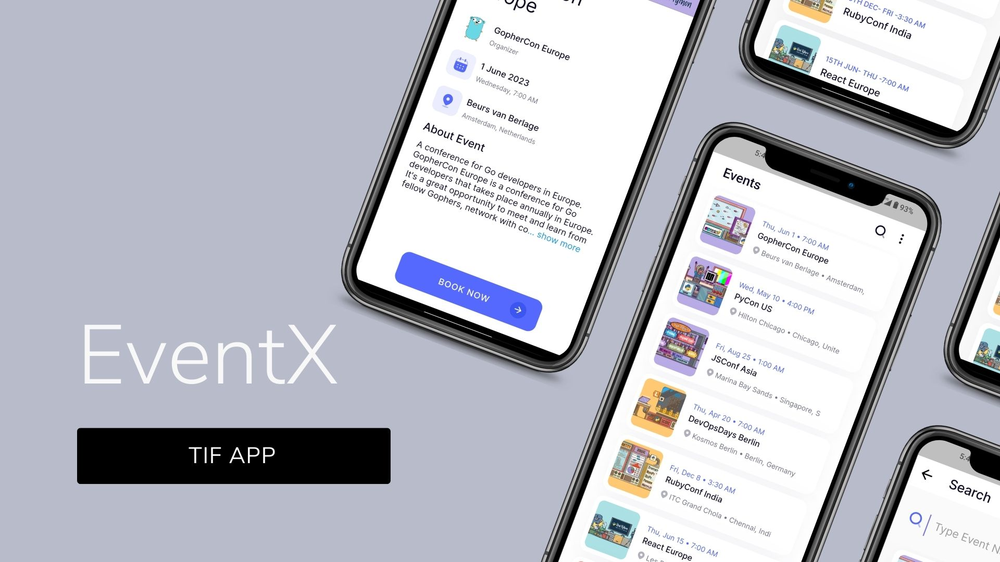
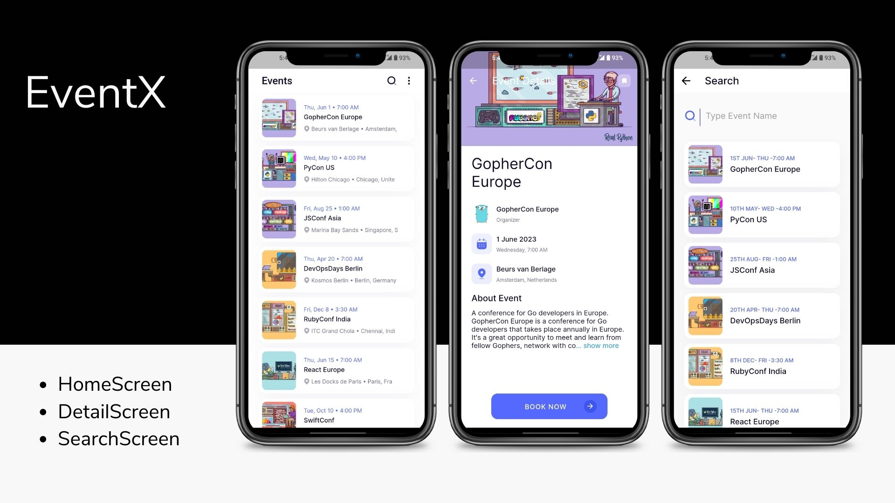
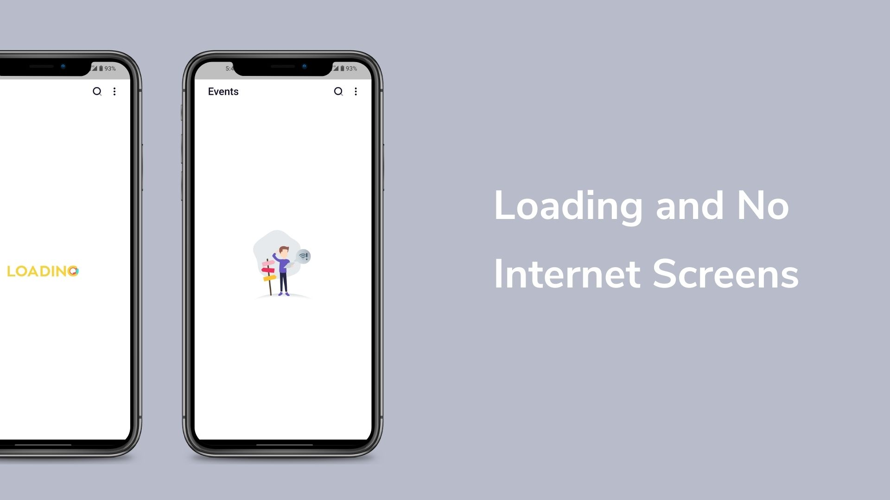

# TIF: Flutter Assignment

The challenge was to build an app in Flutter for events, consisting of three screens - Home, Event Details, and Search. The design for these screens can be found in provided Figma file. The Events were to be fetched using provided Events APIs.

## Screenshots





## Links

| File             | LInk                                                                |
| ----------------- | ------------------------------------------------------------------ |
| Video Preview | [Link](screenshots/ui_sample.mp4) |
| APK File | [.apk](screenshots/app-release.apk)  |


## How to Use 

**Step 1:**

Download or clone this repo by using the link below:

```
https://github.com/Tanay-Gupta/sde_assignment.git
```

**Step 2:**

Go to project root and execute the following command in console to get the required dependencies: 

```
flutter pub get 
```

**Step 3:**

Run the app:

```
flutter run
```

## App Features:

* HomeScreen
* DetailScreen
* SearchScreen
* Animations

### Libraries & Tools Used

* [flutter_bloc](https://pub.dev/packages/flutter_bloc) (State Management)
* [dio](https://pub.dev/packages/dio)
* [pretty_dio_logger](https://pub.dev/packages/pretty_dio_logger) 
* [flutter_svg](https://pub.dev/packages/flutter_svg) 
* [cached_network_image](https://pub.dev/packages/cached_network_image)
* [intl](https://pub.dev/packages/intl)
* [expandable_text](https://pub.dev/packages/expandable_text)
* [lottie](https://pub.dev/packages/lottie)

### Folder Structure
Here is the core folder structure which flutter provides.

```
flutter-app/
|- android
|- build
|- ios
|- lib
|- test
```

Here is the folder structure we have been using in this project

```
lib/
|- data/
|- logic/
|- screens/
|- main.dart
|- values.dart
```

Now, lets dive into the lib folder which has the main code for the application.

```
1- data - Contains the data layer of your project, includes models & API repository .
2- logic - Contains state-management of your application, to connect the reactive data of the application with the UI . 
3- screens — Contains all the ui of your project, contains sub directory for each screen.
4- values.dart — Contains the utilities/common values of the application.
5- main.dart - This is the starting point of the application. All the application level configurations are defined in this file i.e, theme, routes, title, orientation etc.
```


### Data

All the business data & APIs of your application will go into this directory, it represents the data layer of your application. It is sub-divided into two directories `repositories`and `models`, each containing the domain specific data. 

```
data/
|- models/
    |- all_event_model.dart/
   
|- repositories/
    |- api/
    |- api/api.dart
    |- all_event_repository.dart

```

### logic

Cubit is a simpler version of BLoC, introduced as part of the ```flutter_bloc package```. It's a lightweight and more opinionated state management solution than BLoC. It follows the single responsibility principle and relies on a simplified architecture, involving just a few classes

```
logic/
|- cubits/
    |- event_cubit/
        |- event_cubit.dart
        |- event_state.dart
```

### screens

This directory contains all the ui of your application. Each screen is located in a separate folder making it easy to combine group of files related to that particular screen. All the screen specific widgets will be placed in `components` directory as shown in the example below:

```
screens/
|- home
   |- event_container.dart
   |- home_screen.dart

|- search
   |- components
        |- body.dart
        |- eventbox.dart
   |- search_screen.dart

|- event_detail
   |- components
        |- body.dart
   |- detail_screen.dart
```

